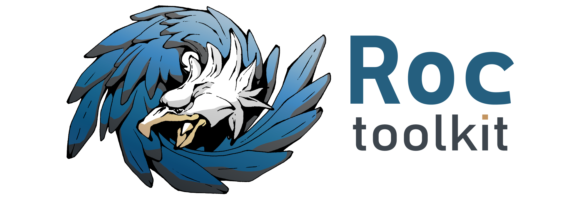

# Roc Toolkit: real-time audio streaming

Roc is a toolkit for real-time audio streaming over the network.

You can read about the project here:

* [Overview](https://roc-streaming.org/toolkit/docs/about_project/overview.html)
* [Features](https://roc-streaming.org/toolkit/docs/about_project/features.html)
* [Usage](https://roc-streaming.org/toolkit/docs/about_project/usage.html)

Summary
-------

The toolkit consists of:

* a C library;
* a set of command-line tools;
* a set of PulseAudio modules.

Key features:

* real-time streaming with guaranteed latency;
* restoring lost packets using Forward Erasure Correction codes;
* converting between the sender and receiver clock domains;
* CD-quality audio;
* multiple profiles for different CPU and latency requirements;
* portability;
* relying on open, standard protocols.

Documentation
-------------

Documentation for the latest release is available [here](https://roc-streaming.org/toolkit/docs/).

Additionally, there is also Doxygen-generated documentation for [internal modules](https://roc-streaming.org/toolkit/doxygen/).

Build status
------------

See details on continuous integration [here](https://roc-streaming.org/toolkit/docs/development/continuous_integration.html).

Branch    | Status
--------- | ------
`master`  | 
`develop` | 

Versioning
----------

See details here:

* [GitHub releases](https://github.com/roc-streaming/roc-toolkit/releases)
* [Changelog](https://roc-streaming.org/toolkit/docs/development/changelog.html)
* [Version control](https://roc-streaming.org/toolkit/docs/development/version_control.html)

Platforms
---------

See details [here](https://roc-streaming.org/toolkit/docs/portability.html).

If you want to run Roc on an embedded system or a single-board computer, see:

* [Cross-compiling](https://roc-streaming.org/toolkit/docs/portability/cross_compiling.html)
* [Tested boards](https://roc-streaming.org/toolkit/docs/portability/tested_boards.html)

Plans
-----

See here:

* [Project board](https://github.com/roc-streaming/roc-toolkit/projects/2)
* [Roadmap](https://roc-streaming.org/toolkit/docs/development/roadmap.html)

Community
---------

We have a mailing list and an IRC channel. See details [here](https://roc-streaming.org/toolkit/docs/about_project/contacts.html).

Contributing
------------

Contributions in any form are always welcome! See [contribution guidelines](https://roc-streaming.org/toolkit/docs/development/contribution_guidelines.html).

Tasks needing help are [listed here](https://github.com/roc-streaming/roc-toolkit/labels/help%20wanted).

Licensing
---------

See details on licenses [here](https://roc-streaming.org/toolkit/docs/about_project/licensing.html).

Authors
-------

See a list of maintainers and contributors [here](https://roc-streaming.org/toolkit/docs/about_project/authors.html).
