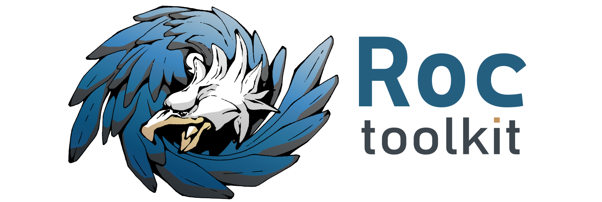

# Roc Toolkit: real-time audio streaming

  

Roc is a toolkit for real-time audio streaming over the network.

You can read about the project here:

* [Overview](https://roc-streaming.org/toolkit/docs/about_project/overview.html)
* [Features](https://roc-streaming.org/toolkit/docs/about_project/features.html)

Summary
-------

The toolkit consists of a [C library](https://roc-streaming.org/toolkit/docs/api.html) and a set of [command-line tools](https://roc-streaming.org/toolkit/docs/tools/command_line_tools.html).

Key features:

* real-time streaming with guaranteed latency;
* restoring lost packets using Forward Erasure Correction codes;
* converting between the sender and receiver clock domains;
* CD-quality audio;
* multiple profiles for different CPU and latency requirements;
* portability;
* relying on open, standard protocols.

Besides library and tools, toolkit provides:

* [bindings](https://roc-streaming.org/toolkit/docs/api/bindings.html) for other programming languages
* [modules](https://roc-streaming.org/toolkit/docs/tools/sound_server_modules.html) for sound servers like PulseAudio and PipeWire
* [applications](https://roc-streaming.org/toolkit/docs/tools/applications.html)

Documentation
-------------

Documentation for the latest release is available [here](https://roc-streaming.org/toolkit/docs/).

Additionally, there is also Doxygen-generated documentation for [internal modules](https://roc-streaming.org/toolkit/doxygen/).

Build status
------------

See details on continuous integration [here](https://roc-streaming.org/toolkit/docs/development/continuous_integration.html).

Branch    | Status
--------- | ------
`master`  | 
`develop` | 

Versioning
----------

See details here:

* [GitHub releases](https://github.com/roc-streaming/roc-toolkit/releases)
* [Changelog](https://roc-streaming.org/toolkit/docs/development/changelog.html)
* [Development workflow](https://roc-streaming.org/toolkit/docs/development/workflow.html)

Platforms
---------

See details [here](https://roc-streaming.org/toolkit/docs/portability.html).

If you want to run Roc on an embedded system or a single-board computer, see:

* [Cross-compiling](https://roc-streaming.org/toolkit/docs/portability/cross_compiling.html)
* [Tested devices](https://roc-streaming.org/toolkit/docs/portability/tested_devices.html)

Plans
-----

See here:

* [Project board](https://github.com/orgs/roc-streaming/projects/5)
* [Roadmap](https://roc-streaming.org/toolkit/docs/development/roadmap.html)

Donations
---------

If you would like to support the project financially, please refer to [this page](https://roc-streaming.org/toolkit/docs/about_project/sponsors.html). This project is developed by volunteers in their free time, and your donations will help to spend more time on the project and keep it growing.

Thank you!

Community
---------

We have a forum, mailing list, and Matrix chat room. See details [here](https://roc-streaming.org/toolkit/docs/about_project/contacts.html).

Contributing
------------

Contributions in any form are always welcome! Please check out [contribution guidelines](https://roc-streaming.org/toolkit/docs/development/contribution_guidelines.html).

Tasks needing help are [listed here](https://github.com/roc-streaming/roc-toolkit/labels/help%20wanted).

Licensing
---------

See details on licenses [here](https://roc-streaming.org/toolkit/docs/about_project/licensing.html).

Authors
-------

See a list of maintainers and contributors [here](https://roc-streaming.org/toolkit/docs/about_project/authors.html).
