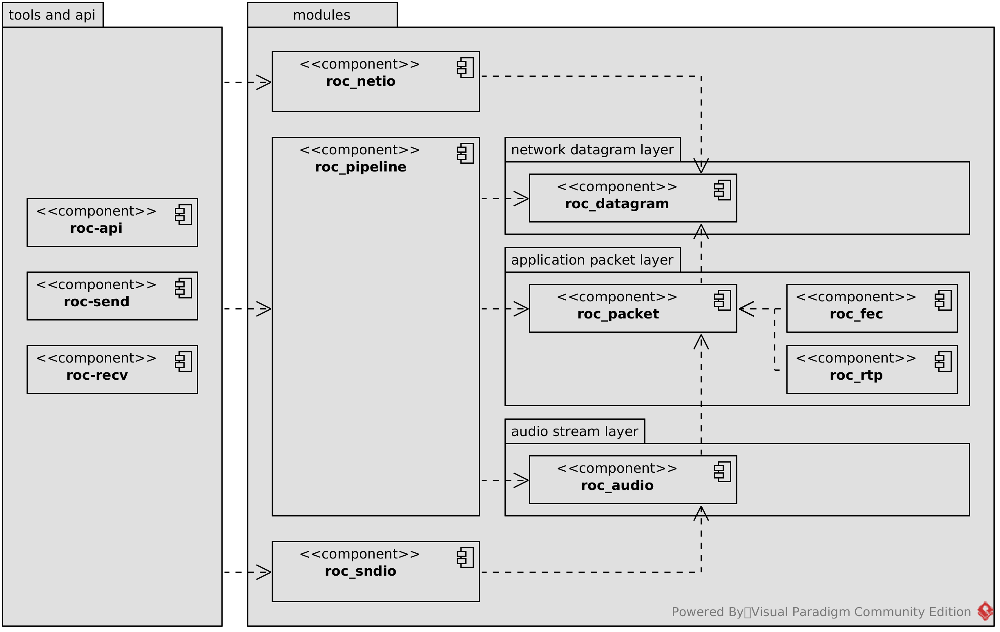

.. _design:

Design overview
***************

Pipelines
=========

Roc's design is all about pipelines of connected *readers* or *writers*. This pattern is repeated on several levels:

* when processing network datagrams;
* when processing higher-level packets;
* when processing audio samples.

Pipeline begins with a *producer* or a *queue*, and ends with a *consumer* or a *queue*. Producer and consumer are connected through a sequence of readers or writers, depending on pipeline direction.

Modules
=======

Roc has a modular structure. Source code is divided into several modules, and we try to keep inter-module dependencies minimal. Dependencies should be specifies explicitly in ``src/build-deps.json``. If some module use another module, and the dependency is not specified there, build will fail (well, it should).

Every module:

* has its own namespace;
* has its own source code directory and include path;
* has its own unit tests;
* has its own SCons target and may be built separately;
* is compiled into separate static library.

=================== =================================
module              Description
=================== =================================
``roc_config``	    Global compile-time configuration options.
roc_core	        Lightweight general-purpose utility classes and wrappers for platform-dependent features.
``roc_datagram``	Protocol-independent network layer datagram processing (e.g. UDP).
``roc_packet``	    Protocol-independent application layer packet processing (e.g. RTP).
``roc_fec``	        FEC codecs. Acts at packet layer.
``roc_audio``	    Audio stream processing.
``roc_rtp``	        Implementation of packets for RTP.
``roc_pipeline``	    Sender and receiver pipelines. Glues roc_datagram, roc_packet, roc_fec, and roc_audio together to convert audio stream to datagrams (sender) or datagrams to audio stream (receiver).
``roc_sndio``	    Sound I/O. Allows to read or write audio stream from/to file or device.
``roc_netio``	    Network I/O. Allows to send or receive datagrams.
=================== =================================

Threads
=======

There are at most three threads, communicating strictly through thread-safe queues:

* datagram queue;
* sample buffer queue.

In sender:
----------

================= ================= =================
Thread	          Module	        Description
================= ================= =================
audio reader	  ``roc_sndio``	        Reads audio stream from input file or device and writes it to sample buffer queue.
sender pipeline	  ``roc_pipeline``	    Reads sample buffers from queue, packs them into packets, composes datagrams from packets, and writes them to datagram queue.
network sender	  ``roc_netio``	        Reads datagrams from queue and sends them to receiver.
================= ================= =================

In receiver:
------------

================= ================= =================
Thread	          Module	        Description
================= ================= =================
network receive   ``roc_netio``     Receives datagrams and writes them to datagram queue.
receiver pipeline ``roc_pipeline``  Reads datagrams from queue, parses packets from datagrams, reconstructs audio stream from packets, and writes it to sample buffer queue.
audio writer      ``roc_sndio``     Reads sample buffers from queue and sends them to output file or device.
================= ================= =================

Flow
====

.. image:: ../diagrams/sender_receiver_flow.png
	:height: 500
	:width: 955 px
	:alt: Samples flow between and inside a sender and a receiver

Data flow detailed:

* **TODO**: Receiver flow

Targets
=======

Roc is targeted for multiple platforms and compilers. The major part of source code is platform-independent, however there are also parts that depend on platform or optional third-party libraries.

To keep code base clean, all platform-dependent code is strictly isolated inside ``target_`` directories. Every such directory corresponds to a feature supported by target platform. When SCons builds the project, it determines target directories to use, depending on target platform and available third-party libraries.

Every module can have its own target directories. Headers from all target directories in use are added to include path, and source files are added to build.

================== =================
Target             Description
================== =================
``target_posix``   Enabled when building for POSIX systems.
``target_stdio``   Enabled when standard input/output is supported in libc.
``target_gnu``     Enabled when GNU-compatible compiler is in use (GCC or clang).
``target_uv``      Enabled when libuv is available.
``target_openfec`` Enabled when OpenFEC is available.
``target_sox``     Enabled when SoX is available.
================== =================

Several target directories may contain alternative implementations of the same classes or functions, compatible at the source level. For example, ``class SpinLock`` could have independent declarations and implementations inside ``target_posix`` and ``target_win32``.
