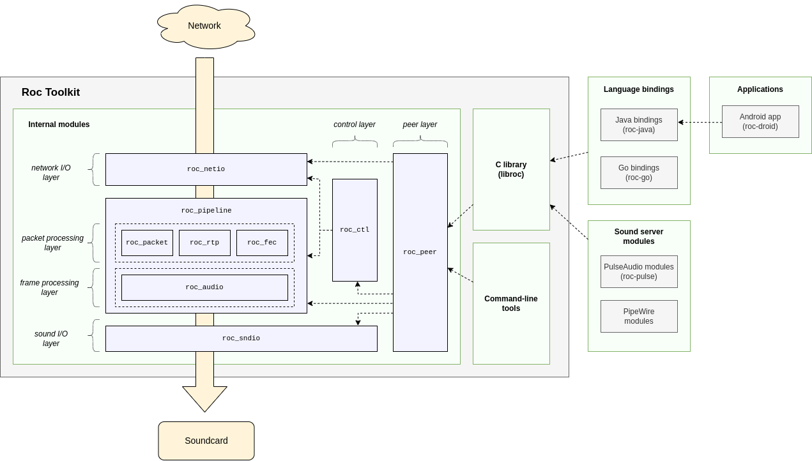

Code structure
**************

.. contents:: Table of contents:
   :local:
   :depth: 1

Overview
========

`Roc Toolkit <https://github.com/roc-streaming/roc-toolkit>`_ consists of the following high-level components:

* **Internal modules**

  Internal C++ libraries, not part of public API. Basic building blocks for library and tools. See `Doxygen documentation <https://roc-streaming.org/toolkit/doxygen/>`_ for details.

* **C library**

  Public C API (libroc) for C and C++ applications. See :doc:`/api` page.

* **Command-line tools**

  Command-line tools for developers and advanced users. See :doc:`/tools/command_line_tools` page.

Besides toolkit, `Roc Streaming <https://github.com/roc-streaming>`_ project provides some software on top of it:

* **Language bindings**

  Library bindings for other programming languages. See :doc:`/api/bindings` page.

* **Sound server modules**

  Modules for OS-specific sound servers, like PulseAudio and PipeWire. See :doc:`/tools/sound_server_modules` page.

* **Applications**

  Desktop and mobile apps for end-users. See :doc:`/tools/applications` page.

Modules
=======

Essentially, a module is just a C++ library providing a set of related classes. Every module has its own namespace, include path, and a set of unit tests. Modules may be built separately.

See `Doxygen documentation <https://roc-streaming.org/toolkit/doxygen/>`_ for details.

Modules can be grouped into several layers, as shown on the diagram above:

* network I/O layer (roc_netio)

* processing layer (roc_pipeline), with two sub-layers:

 * packet processing sub-layer (roc_packet, roc_rtp, roc_rtcp, roc_fec, and others)

 * frame processing sub-layer (roc_audio)

* sound I/O layer (roc_sndio)

* control layer (roc_ctl)

* node layer (roc_node)

On receiver media flows from network I/O layer, through processing layer, to sound I/O layer. Accordingly, on sender media flows from sound I/O layer, through processing layer, to network I/O layer. On both receiver and sender, there is also control layer that handles various supportive tasks. Finally, node layer is a top-level layer which glues everything together.

Here is the full list of available modules:

================= =================================
module            description
================= =================================
`roc_core`_       General-purpose building blocks (containers, memory management, multithreading, etc)
`roc_stat`_       Statistical functions
`roc_status`_     Status codes
`roc_address`_    Network URIs and addresses
`roc_packet`_     Network packets and packet processing
`roc_rtp`_        RTP support
`roc_rtcp`_       RTCP support
`roc_fec`_        FEC support
`roc_sdp`_        SDP support
`roc_audio`_      Audio frames and audio processing
`roc_pipeline`_   Pipeline loop that arranges all packet and frame processors into a chain
`roc_ctl`_        Control loop that handles signaling protocols and background tasks
`roc_netio`_      Network I/O loop
`roc_sndio`_      Sound I/O loop
`roc_dbgio`_      Debugging I/O (dumps, temp files)
`roc_node`_       Top-level module that glues everything together
================= =================================

.. _roc_core: https://roc-streaming.org/toolkit/doxygen/namespaceroc_1_1core.html
.. _roc_stat: https://roc-streaming.org/toolkit/doxygen/namespaceroc_1_1stat.html
.. _roc_status: https://roc-streaming.org/toolkit/doxygen/namespaceroc_1_1status.html
.. _roc_address: https://roc-streaming.org/toolkit/doxygen/namespaceroc_1_1address.html
.. _roc_packet: https://roc-streaming.org/toolkit/doxygen/namespaceroc_1_1packet.html
.. _roc_rtp: https://roc-streaming.org/toolkit/doxygen/namespaceroc_1_1rtp.html
.. _roc_rtcp: https://roc-streaming.org/toolkit/doxygen/namespaceroc_1_1rtcp.html
.. _roc_fec: https://roc-streaming.org/toolkit/doxygen/namespaceroc_1_1fec.html
.. _roc_sdp: https://roc-streaming.org/toolkit/doxygen/namespaceroc_1_1sdp.html
.. _roc_audio: https://roc-streaming.org/toolkit/doxygen/namespaceroc_1_1audio.html
.. _roc_pipeline: https://roc-streaming.org/toolkit/doxygen/namespaceroc_1_1pipeline.html
.. _roc_ctl: https://roc-streaming.org/toolkit/doxygen/namespaceroc_1_1ctl.html
.. _roc_netio: https://roc-streaming.org/toolkit/doxygen/namespaceroc_1_1netio.html
.. _roc_sndio: https://roc-streaming.org/toolkit/doxygen/namespaceroc_1_1sndio.html
.. _roc_dbgio: https://roc-streaming.org/toolkit/doxygen/namespaceroc_1_1dbgio.html
.. _roc_node: https://roc-streaming.org/toolkit/doxygen/namespaceroc_1_1node.html

.. _targets:

Targets
=======

Roc supports multiple platforms and compilers. The major part of the source code is platform-independent. However, there are also parts that depend on specific platform features or optional third-party libraries.

Such platform-dependent code is isolated inside "target" directories. Every target directory corresponds to platform or feature enabled at compile time. When SCons builds the project, it determines target directories to use, depending on the target platform, available third-party libraries, and command-line options.

Every module can have its own target directories. Headers from enabled target directories are added to the include path, and source files from enabled target directories are added to the build.

Currently supported targets are:

===================== ===============================================
target                description
===================== ===============================================
target_pc             Enabled for PC (like server, desktop, laptop)
target_posix          Enabled for a POSIX OS
target_posix_ext      Enabled for a POSIX OS with POSIX extensions
target_posix_pc       Enabled for a POSIX OS on PC
target_gnu            Enabled for GNU-like libc and compiler
target_darwin         Enabled for macOS
target_android        Enabled for Android
target_c11            Enabled for C11 compilers
target_libunwind      Enabled if libunwind is available
target_libatomic_ops  Enabled if libatomic_ops is available
target_libuv          Enabled if libuv is available
target_openfec        Enabled if OpenFEC is available
target_speexdsp       Enabled if SpeexDSP is available
target_sox            Enabled if SoX is available
target_sndfile        Enabled if libsndfile is available
target_pulseaudio     Enabled if PulseAudio is available
target_nobacktrace    Enabled if no backtrace API is available
target_nodemangle     Enabled if no demangling API is available
===================== ===============================================

Example directory structure employing targets:

::

    roc_core
    ├── target_posix
    │   └── roc_core
    │       ├── ...
    │       ├── mutex.cpp
    │       └── mutex.h
    ├── target_posix_ext
    │   └── roc_core
    │       ├── ...
    │       ├── time.cpp
    │       └── time.h
    ├── target_darwin
    │   └── roc_core
    │       ├── ...
    │       ├── time.cpp
    │       └── time.h
    ├── ...
    ├── array.h
    └── list.h
