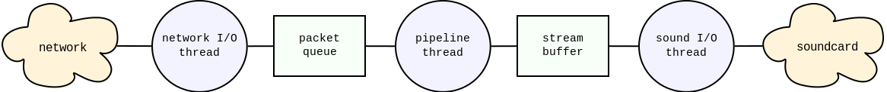
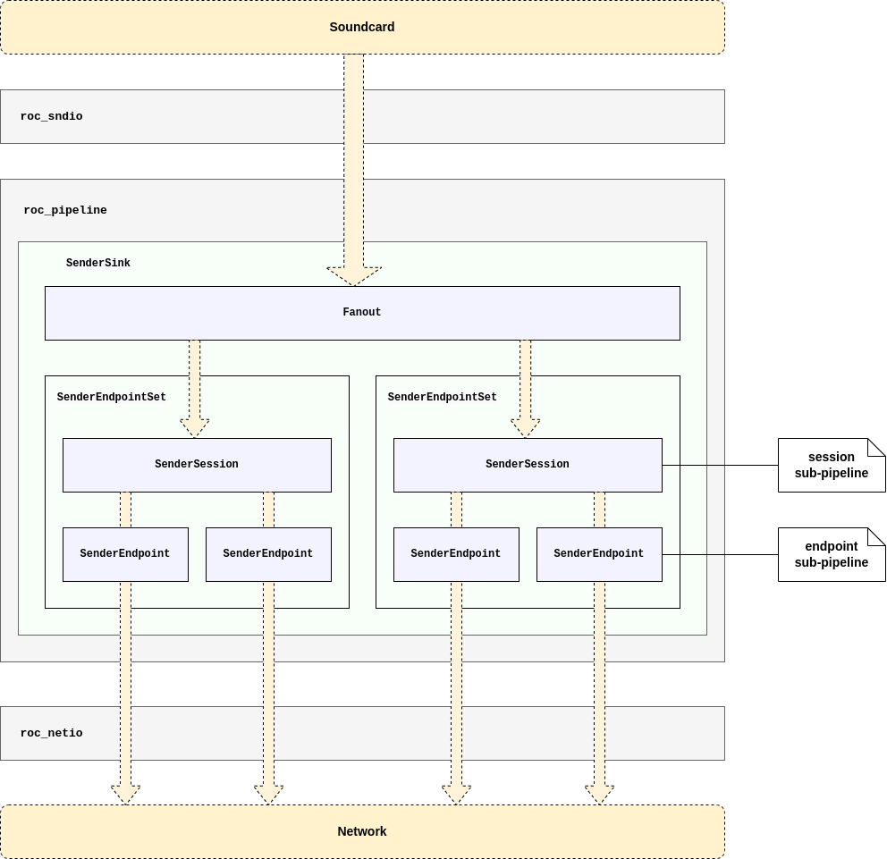
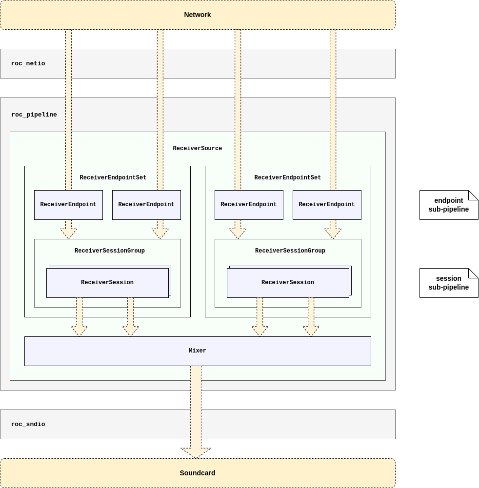

Data flow
*********

.. contents:: Table of contents:
   :local:
   :depth: 1

Execution threads
=================

Both Roc sender and receiver use threads of up to three types:

* network I/O thread running event loop, capable of sending and receiving packets via multiple sockets;

* processing pipeline thread running sender or receiver pipeline, converting packet stream to audio stream or vice versa;

* sound I/O thread running audio device reader or writer.

Roc command-line tools create these three threads. The network I/O and the processing pipeline threads are managed by Roc itself (though the I/O part is done by libuv), and the sound I/O thread is managed by SoX library. The presence of the sound I/O thread is optional and depends on the selected SoX backend.

Roc library, in contrast, creates only the network I/O thread. The processing pipeline is running in the caller context when the user reads or writes audio stream. The sound I/O is not performed at all and users should implement it by themselves using other available libraries dedicated for that purpose.

It is also worth to mention that Roc library allows both creating individual network I/O threads for every sender or receiver, and sharing a single network I/O thread between multiple senders or receivers.

Threads typically don't share much state and mostly communicate via queues. The network I/O and the processing pipeline threads communicate via packet queues for incoming and outgoing packets. The sound I/O and the processing pipeline threads communicate via a stream buffer which implementation is specific for the selected SoX backend.

The following diagram gives a conceptual view of both sender and receiver structure:

The difference is that on the receiver data is transferring from the network to the sound card and on the sender it is transferring from the sound card to the network.

Pipeline structure
==================

Pipelines used in sender and receiver are chains of consecutively connected elements. Each element has a reference to the inner element (or sometimes multiple elements) and adds some pre- or post-processing on top of it.

The element interface depends on the pipeline type, which may be packet or frame, and pipeline direction, which may be read or write. Therefore, there are four element interfaces: packet reader, packet writer, frame reader, frame writer.

Some elements may implement one interface but refer to an inner element of another interface, or implement multiple interfaces. Such elements act as adapters between sub-pipelines of different types or directions.

Pipeline timing
===============

The key feature of pipelines is that they are passive and are clocked by their users.

When the user reads or writes packet or frame from the top-level pipeline element, the call is recursively propagated to inner elements. Every element tries to perform the amount of work required to advance the stream exactly by one packet or frame, or to be as close as possible to it.

This allows doing things in time and in the right clock domain. This is important for two reasons.

First, every device, including the CPU and the sound card, has its own clock domain and has a bit different frequency than all other devices, even if nominally the frequencies are configured to be the same. Therefore, the real-time stream on the sender or receiver can't have its own CPU timer but instead should be driven in the sound card clock domain. Otherwise, the pipeline stream will eventually lag behind or ahead of the sound card stream.

Second, the receiver should advance the stream exactly when it's time to pass the corresponding samples to the sound card. Advancing the stream too late will cause glitches. Advancing the stream too early can cause glitches as well because chances are that some packets are not yet received by this time and so they will be considered lost, even though they can be received a bit later but still within the acceptable latency.

Note that, however, if the sender or receiver works with a sound file instead of a sound card, the pipeline is clocked by a CPU timer because the sound file obviously does not have its own real-time clock.

Another important point is that the sender and receiver have different clock domains as well. To deal with it, there is a resampler in the receiver pipeline, which dynamically converts the sender clock domain to the receiver clock domain by adjusting the sample rate. See :doc:`/internals/fe_resampler`.

Sender pipeline
===============

The diagram below shows an example of the sender pipeline.

Some of the elements shown can be removed from the pipeline or replaced with other elements depending on the sender configuration. For instance, resampling and FEC can be disabled completely, the specific RTP and FEC encoders can be changed, and the number and contents of the port pipelines depend on the network ports and protocols being used.

The sender pipeline is a writer pipeline. The sound card thread writes frames to the pipeline, and the pipeline writes packets to the network thread queue.

In general terms, the flow is the following:

* the sound card thread writes a frame to the pipeline;
* the frame passes through several frame writers;
* the frame is split into packets;
* the packets pass through several packet writers;
* each packet is routed to a sender port pipeline, according to the packet stream identifier;
* in the port pipeline, packet headers and payload are composed, depending on the port protocol;
* the packets are written to the network thread queue.

The specific functions of the individual pipeline elements are documented in `Doxygen <https://roc-streaming.org/toolkit/doxygen/>`_.

Receiver pipeline
=================

The diagram below shows an example of the receiver pipeline.

Some of the elements shown can be removed from the pipeline or replaced with other elements depending on the receiver configuration. For instance, resampling and FEC can be disabled completely, the specific RTP and FEC decoders can be changed, and the number and contents of the port pipelines depend on the network ports and protocols being used.

The receiver pipeline is a combination of writer and reader pipelines. The network thread writes packets to the pipeline, and the sound card thread reads frames from the pipeline.

The flow of the write part is the following:

* each packet received from the network is routed to a receiver port pipeline, according to the packet destination address;
* in the port pipeline, packet headers and payload are parsed, according to the port protocol;
* each packet is routed to a receiver session pipeline, according to the packet source address;
* in the session pipeline, each packet is routed to a specific queue, according to the packet stream identifier;
* the packet is stored in that queue.

The flow of the read part is the following:

* the sound card thread requests a frame from the receiver pipeline;
* the receiver pipeline requests a frame from every receiver session pipeline;
* the frame is requested through several frame readers;
* the frame is being built from packets, for which the packets are requested from packet readers;
* the packets are requested through several packet readers;
* the packets are fetched from the queues where they were stored by the write part.

The specific functions of the individual pipeline elements are documented in `Doxygen <https://roc-streaming.org/toolkit/doxygen/>`_.

Routing in receiver
===================

The receiver can be bound to multiple network ports and serve multiple streams from multiple senders.

For every network port bound, the receiver creates a receiver port pipeline. For every connected sender, the receiver creates a receiver session pipeline. For every stream inside the session, the receiver creates a separate packet queue.

The mapping between ports and sessions is many-to-many, i.e. packets can be routed from one port to many sessions, as well as they can be routed to one session from many ports.

A typical receiver session employs FEC and hence consists of two streams, one for source and another for repair packets. Respectively, such a session gets packets from two receiver ports, one for source and another for repair packets.

When a packet is received from the network, it is routed to an appropriate port pipeline according to the packet destination address. After passing the port pipeline, the packet is routed to an appropriate session pipeline, according to the packet source address. If there is no session for that address, a new one is automatically created. Inside the session pipeline, the packet is routed to an appropriate queue, according to the packet stream identifier.

When a frame is requested by the sound card, the receiver requests a frame from every existing session pipeline and then mixes all frames into one and returns the result.

The diagram below illustrates this routing.

.. image:: ../_images/receiver_routing.png
    :align: center
    :width: 835px
    :alt: Receiver pipeline
