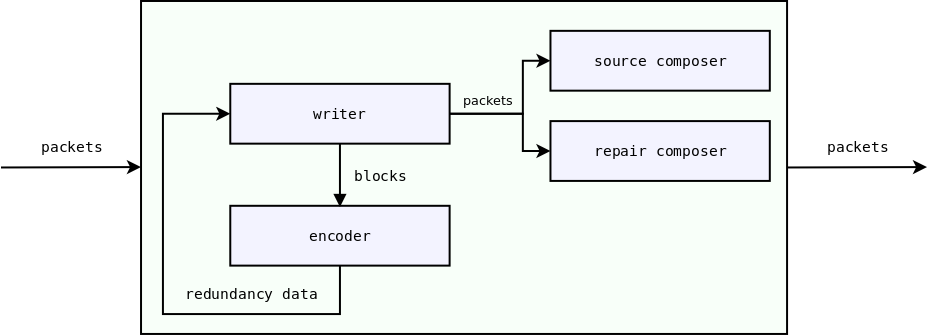

Forward Erasure Correction codes
********************************

.. contents:: Table of contents:
   :local:
   :depth: 1

Preface
=======

A network can be relatively reliable (e.g. Ethernet) or unreliable (e.g Wi-Fi or Internet). Unreliable networks require to use some techniques to recover lost data. Two known techniques are sending acknowledgments and retransmitting lost packets (like in TCP), and adding redundancy and then using it to restore lost packets (`Forward Erasure Correction codes <https://en.wikipedia.org/wiki/Erasure_code>`_).

Roc counters packet losses by incorporating several Forward Erasure Correction codes.

Rationale
=========

Why not just use TCP? The reason is that TCP can provide you with reliable transport, but can't guarantee a fixed latency and thus is not suitable for real-time streaming.

For real-time streaming, we usually use RTP, which is a UDP-based protocol. Bare RTP can provide you with a fixed latency, but it doesn't counter packet losses. At this step erasure detection and correction comes into play. It allows recovering some degree of lost packets while still maintaining a fixed latency.

FEC codes has the following advantages:

* the probability of packet delivery is increased;
* the latency can still be fixed;

and the following costs:

* the latency is increased (in proportion to the block size; see below);
* the traffic is increased (in proportion to the redundancy level).

FECFRAME
========

`RFC 6363 <https://tools.ietf.org/html/rfc6363>`_ defines the FEC Framework (FECFRAME), a framework that describes how to use FEC codes with RTP in the network applications. FECFRAME does not provide 100% reliability like TCP does, it just increases the probability that the packet will be delivered, in proportion to the selected redundancy level.

FECFRAME specifies the `generic structure <https://tools.ietf.org/html/rfc6363#section-5>`_
of source and repair packets, grouped into blocks. Source packets contain original data. Repair packets contain redundant data used for recovery. And blocks group the source packets with the corresponding repair packets which are protecting them.

For example, the sender can be configured to add 5 repair packets to every 10 source packets, thus forming blocks of 15 packets. This allows the receiver to recover up to 5 source packets if they get lost or delayed. On the other hand, using 10+5 blocks also requires the latency to be at least 10 packets because when a packet is lost at the beginning of the block, you may need all the remaining packets of this block to be able to recover the lost packet. It also increases the data rate in 1.5 (15/10) times.

FECFRAME doesn't define protocols and codecs by itself but instead allows different FEC schemes. An FEC scheme defines source and repair packet formats, FEC encoding (building the redundancy data), and decoding (repairing lost data).

Roc implements the FECFRAME specification with several FEC schemes. The packet level is implemented in Roc itself, and the codec level is implemented in `OpenFEC library <http://openfec.org>`_. Currently, it's highly recommended to use `our fork <https://github.com/roc-streaming/openfec>`_ instead of the upstream version since it provides several bug fixes and minor improvements that are not available in the upstream yet.

Roc currently supports the following FEC schemes:

* `Reed-Solomon <https://tools.ietf.org/html/rfc6865>`_, suitable for smaller block sizes and latency (`wikipedia <https://en.wikipedia.org/wiki/Reed%E2%80%93Solomon_error_correction>`_);
* `LDPC-Staircase <https://tools.ietf.org/html/rfc6816>`_, suitable for larger block sizes and latency.

FEC scheme implementations are encapsulated by an interface and new schemes can be added easily enough.

FEC packet fields
===================

The following fields are present in the source and repair packets:

* ESI(encoding symbol id) -- number of a packet (source or repair) in a block;
* SBN(source block number) -- number of a source block in a packet stream;
* SBL(source block length) -- number of source packets in a block;
* BLEN(block length), or NEC(number encoding symbols) -- number of source and repair packets in a block.

Sender
======

The diagram below shows a piece of the sender pipeline responsible for FEC.

* writer works with the packets flow, cuts this flow into blocks;
* writer passes contents of current block to encoder;
* encoder produces the redundancy data;
* writer builds repair packets from the redundancy data;
* writer adds FEC packet fields to packets;
* writer passes packets to composer;
* composer writes FEC packet fields to the underlying packet payload;
* writer passes packets to the further pipeline components.

encoder and composer are encapsulated by an interface, implementations are chosen depending on the FEC scheme.

Receiver
========

The diagram below shows a piece of the receiver pipeline responsible for FEC.

.. image:: ../_images/fec_reader_overview.png
    :align: center
    :width: 650px
    :alt: Reader overview

* reader works with the packets flow, cuts this flow into blocks;
* if there are lost packets in the current block:

  * reader passes contents of the current block to decoder;
  * decoder tries to recover lost packets;
  * reader passes the recovered packet data to parser;
  * parser builds the packet from the recovered data;

* reader passes packets to the further pipeline components.

decoder and parser are encapsulated by an interface, implementations are chosen depending on the FEC scheme.
