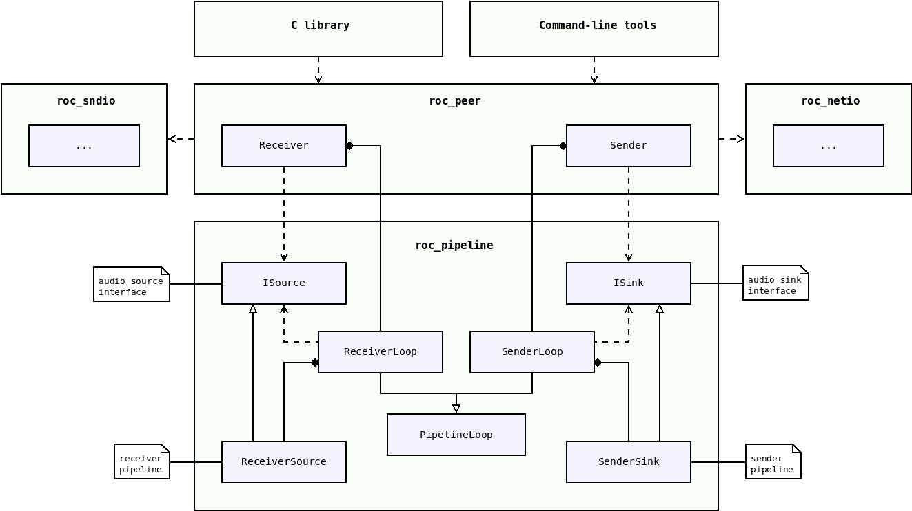
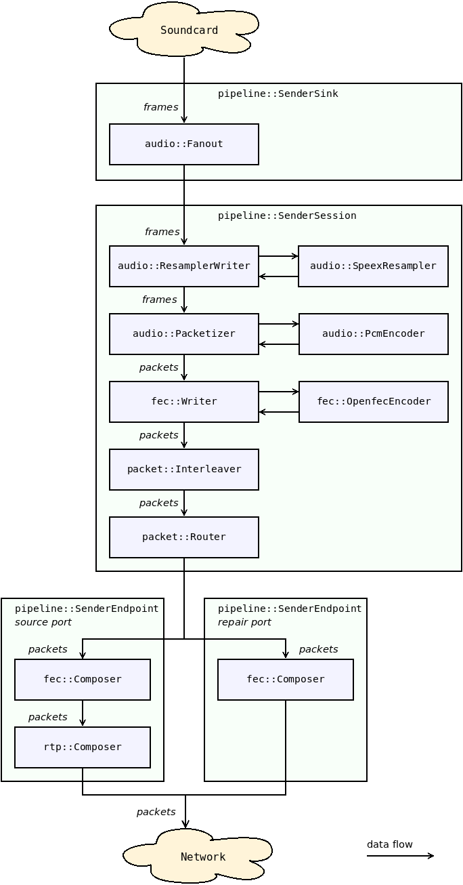
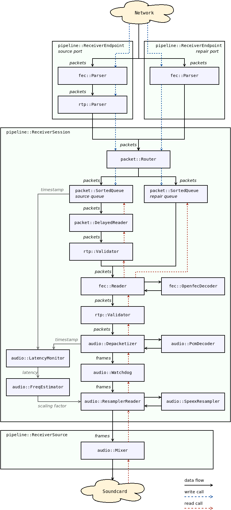

Media pipelines
***************

.. contents:: Table of contents:
   :local:
   :depth: 1

Overview
========

Media pipelines are implemented in ``roc_pipeline`` module. There are two major pipeline types:

* sender pipeline, implemented in `SenderSink <https://roc-streaming.org/toolkit/doxygen/classroc_1_1pipeline_1_1SenderSink.html>`_
* receiver pipeline, implemented in `ReceiverSource <https://roc-streaming.org/toolkit/doxygen/classroc_1_1pipeline_1_1ReceiverSource.html>`_

Essentially, pipeline class constructs chain of :doc:`packet and frame </internals/packets_frames>` processors from ``roc_packet``, ``roc_audio``, and other modules, forming a big composite processor. Sender pipeline can be seen as a processor that consumes audio frames and produces network packets. Receiver pipeline, accordingly, consumes packets and produces frames.

Sender and receiver pipelines implement `ISink <https://roc-streaming.org/toolkit/doxygen/classroc_1_1sndio_1_1ISink.html>`_ and `ISource <https://roc-streaming.org/toolkit/doxygen/classroc_1_1sndio_1_1ISource.html>`_ interfaces, respectively. Sink interface allows to write audio frames to it (sender pipeline input), and source interface allows to read audio frames from it (receiver pipeline output).

Except reading and writing frames, we need to be able to change pipeline configuration on fly. To achieve this, pipelines provide task-based interface for configuration operations. The foundation for task processing is implemented in `PipelineLoop <https://roc-streaming.org/toolkit/doxygen/classroc_1_1pipeline_1_1PipelineLoop.html>`_ class, which allows to schedule tasks for execution in between frames. `SenderLoop <https://roc-streaming.org/toolkit/doxygen/classroc_1_1pipeline_1_1SenderLoop.html>`_ and `ReceiverLoop <https://roc-streaming.org/toolkit/doxygen/classroc_1_1pipeline_1_1ReceiverLoop.html>`_ inherit this class and provide a set of tasks suitable for configuration of corresponding pipelines.

``SenderLoop`` and ``ReceiverLoop`` are used by ``roc_node`` module. It is a top-level module that combines together ``roc_pipeline`` (processing), ``roc_netio`` (network I/O), and ``roc_sndio`` (sound I/O). It uses ``SenderLoop`` and ``ReceiverLoop`` to configure pipeline and to retrieve ``ISink`` or ``ISource`` (which under the hood is implemented by ``SenderSink`` or ``ReceiverSource``). The latter is then used to transform audio frames retrieved from ``roc_sndio`` into network packets passed to ``roc_netio``, or vice versa.

The diagram below demonstrates this.

Pipeline tasks
==============

Pipeline configuration is done via task-based interface. When you want to change pipeline layout or options, you create a task and ask pipeline to schedule it. The task will be then executed on pipeline thread, usually before processing next frame.

This approach have two important advantages:

* frame processing is not interrupted or delayed by other threads; pipeline is free to decide when it's the best time to perform configuration

* except task queue, no other pipeline elements should be thread-safe

For further details, see :doc:`threads`.

Pipeline timing
===============

The key feature of pipelines is that they are passive and are clocked by their user.

When the user reads or writes packet or frame from the top-level pipeline element, the call is recursively propagated to inner elements. Every element tries to perform the amount of work required to advance the stream exactly by one packet or frame, or to be as close as possible to it.

This allows doing things in time and in the right clock domain. This is important for two reasons.

First, every device, including the CPU and the sound card, has its own clock domain and has a bit different frequency than all other devices, even if nominally the frequencies are configured to be the same. Therefore, the real-time stream on the sender or receiver can't have its own CPU timer but instead should be driven in the sound card clock domain. Otherwise, the pipeline stream will eventually lag behind or ahead of the sound card stream.

Second, the receiver should advance the stream exactly when it's time to pass the corresponding samples to the sound card. Advancing the stream too late will cause glitches. Advancing the stream too early can cause glitches as well because chances are that some packets are not yet received by this time and so they will be considered lost, even though they can be received a bit later but still within the acceptable latency.

Note that, however, if the sender or receiver works with a sound file instead of a sound card, the pipeline is clocked by a CPU timer because the sound file obviously does not have its own real-time clock.

Another important point is that the sender and receiver have different clock domains as well. To deal with it, there is a resampler in the receiver pipeline, which dynamically converts the sender clock domain to the receiver clock domain by adjusting the sample rate. See :doc:`/internals/fe_resampler`.

Pipeline structure
==================

Pipelines used in sender and receiver are chains of consecutively connected elements. Each element has a reference to the inner element (or sometimes multiple elements) and adds some pre- or post-processing on top of it.

The element interface depends on the pipeline type, which may be packet or frame, and pipeline direction, which may be read or write. Therefore, there are four element interfaces: packet reader, packet writer, frame reader, frame writer.

Some elements may implement one interface but refer to an inner element of another interface, or implement multiple interfaces. Such elements act as adapters between sub-pipelines of different types or directions.

Sender and receiver slots
=========================

Both sender and receiver pipeline have support for slots. Slots allow single sender or receiver to have multiple groups of endpoints, even if those endpoints use different protocols.

For example, on receiver you can create one slot with a single endpoint (RTP), and another slot with a pair of source and repair endpoints (RTP + Reed-Solomon FEC). Senders that support only RTP will send packets to the first slot, and senders that support FECFRAME will send packets to the second slot. A single receiver will be able to handle both types of sender.

Another example is to create two sender slots, connected to different receivers (probably via different protocols). This way single sender will be able to forward traffic to multiple receivers.

Each slot can have at most one endpoint of each type:

* source endpoint (for media packets)
* repair endpoint (for FEC packets)
* control endpoint (for control packets)

Sender pipeline
===============

The diagram below shows the structure of sender pipeline.

Sender pipeline is composed from several classes:

* `SenderSink <https://roc-streaming.org/toolkit/doxygen/classroc_1_1pipeline_1_1SenderSink.html>`_ - top-level class, represents the whole sender pipeline; contains one or several slots, and a fanout

* `SenderSlot <https://roc-streaming.org/toolkit/doxygen/classroc_1_1pipeline_1_1SenderSlot.html>`_ - represents one slot of the sender; contains a set of related endpoints (e.g. source, repair, and control) and one sender session

* `SenderEndpoint <https://roc-streaming.org/toolkit/doxygen/classroc_1_1pipeline_1_1SenderEndpoint.html>`_ - represents endpoint sub-pipeline; implements packet processing specific to endpoint

* `SenderSession <https://roc-streaming.org/toolkit/doxygen/classroc_1_1pipeline_1_1SenderSession.html>`_ - represents session sub-pipeline; implements the main part of sender processing

.. image:: ../_images/sender_pipeline.png
    :align: center
    :width: 700px
    :alt: Sender pipeline

Sender sub-pipelines
====================

The diagram below shows an example of the sender session and endpoint sub-pipelines.

Some of the elements shown can be removed from the pipeline or replaced with other elements depending on the sender configuration. For instance, resampling and FEC can be disabled completely, the specific RTP and FEC encoders can be changed, and the number and contents of the port pipelines depend on the network ports and protocols being used.

The sender pipeline is a writer pipeline. The sound card thread writes frames to the pipeline, and the pipeline writes packets to the network thread queue.

In general terms, the flow is the following:

* the sound card thread writes a frame to the pipeline;
* the frame passes through fanout to session pipeline of each sender slot;
* the frame passes through several frame writers;
* the frame is split into packets;
* the packets pass through several packet writers;
* each packet is routed to appropriate endpoint pipeline, according to the packet stream identifier;
* in the endpoint pipeline, packet headers and payload are composed, depending on the endpoint protocol;
* the packets are written to the network thread queue.

The specific functions of the individual pipeline elements are documented in `Doxygen <https://roc-streaming.org/toolkit/doxygen/>`_.

Receiver pipeline
=================

The diagram below shows the structure of receiver pipeline.

Receiver pipeline is composed from several classes:

* `ReceiverSource <https://roc-streaming.org/toolkit/doxygen/classroc_1_1pipeline_1_1ReceiverSource.html>`_ - top-level class, represents the whole receiver pipeline; contains one or several slots, and a mixer

* `ReceiverSlot <https://roc-streaming.org/toolkit/doxygen/classroc_1_1pipeline_1_1ReceiverSource.html>`_ - represents one slot of the receiver; contains a set of related endpoints (e.g. source, repair, and control) and a session group

* `ReceiverEndpoint <https://roc-streaming.org/toolkit/doxygen/classroc_1_1pipeline_1_1ReceiverEndpoint.html>`_ - represents endpoint sub-pipeline; implements packet processing specific to endpoint

* `ReceiverSessionGroup <https://roc-streaming.org/toolkit/doxygen/classroc_1_1pipeline_1_1ReceiverSessionGroup.html>`_ - represents a set of sessions belonging to one slot; implements routing of packets to sessions

* `ReceiverSession <https://roc-streaming.org/toolkit/doxygen/classroc_1_1pipeline_1_1ReceiverSession.html>`_ - represents session sub-pipeline; created for every sender connected to receiver; implements processing specific to that session

.. image:: ../_images/receiver_pipeline.png
    :align: center
    :width: 700px
    :alt: Receiver pipeline

Receiver sub-pipelines
======================

The diagram below shows an example of the receiver session and endpoint sub-pipelines.

Some of the elements shown can be removed from the pipeline or replaced with other elements depending on the receiver configuration. For instance, resampling and FEC can be disabled completely, the specific RTP and FEC decoders can be changed, and the number and contents of the port pipelines depend on the network ports and protocols being used.

The receiver pipeline is a combination of writer and reader pipelines. The network thread writes packets to the pipeline, and the sound card thread reads frames from the pipeline.

The flow of the write part is the following:

* packet received from the network is routed to appropriate endpoint pipeline, according to the packet destination address;
* in the endpoint pipeline, packet headers and payload are parsed, according to the endpoint protocol;
* packet is routed to session group of the receiver slot to which endpoint belongs;
* packet is routed to appropriate session pipeline, according to the packet source;
* in the session pipeline, packet is routed to a specific queue, according to the packet stream identifier;
* the packet is stored in that queue.

The flow of the read part is the following:

* the sound card thread requests a frame from the receiver pipeline;
* the receiver pipeline requests a frame from mixer
* mixer requests a frame from every session pipeline of every receiver slot;
* the frame is requested through several frame readers;
* the frame is being built from packets, for which the packets are requested from packet readers;
* the packets are requested through several packet readers;
* the packets are fetched from the queues where they were stored by the write part.

The specific functions of the individual pipeline elements are documented in `Doxygen <https://roc-streaming.org/toolkit/doxygen/>`_.

