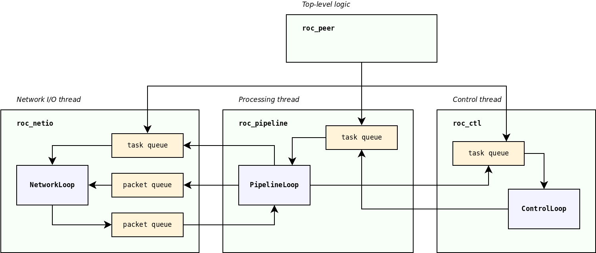

Threads and queues
******************

.. contents:: Table of contents:
   :local:
   :depth: 1

Threads
=======

Roc senders and receivers typically employ several threads.

* **Network I/O thread**

  Network event loop thread. Sends packets from outgoing queue. Receives packets and stores into incoming queue.

  Implemented by `NetworkLoop <https://roc-streaming.org/toolkit/doxygen/classroc_1_1netio_1_1NetworkLoop.html>`_ class from ``roc_netio`` module.

* **Sound I/O thread**

  Audio input or output thread. Sends audio frames to sound card, or receives frames from it.

  Implemented by `sinks <https://roc-streaming.org/toolkit/doxygen/classroc_1_1sndio_1_1ISink.html>`_ and `sources <https://roc-streaming.org/toolkit/doxygen/classroc_1_1sndio_1_1ISource.html>`_ from ``roc_sndio`` module.

* **Pipeline thread**

  Processing thread. Converts a stream of network packets into a stream of audio frames (on receiver), or vice versa (on sender).

  Implemented by `PipelineLoop <https://roc-streaming.org/toolkit/doxygen/classroc_1_1pipeline_1_1PipelineLoop.html>`_ and its derived classes from ``roc_pipeline`` module.

* **Control thread**

  Control task event loop. Executes asynchronous tasks for signaling protocols and background work.

  Implemented by `ControlLoop <https://roc-streaming.org/toolkit/doxygen/classroc_1_1ctl_1_1ControlLoop.html>`_ class from ``roc_ctl`` module.

Depending on sound system in use, sound I/O thread and pipeline thread may be the same thread. For example, on ALSA a single thread performs audio I/O and processing, and on PulseAudio, there are separate threads for I/O and processing.

When the user uses ``roc_sender`` or ``roc_receiver`` from the :doc:`C library </api/reference>`, Roc does not manage sound I/O. It also does not create dedicated pipeline thread - instead, the user invokes pipeline processing on their own thread.

Network and control threads belong to context. Sound I/O and pipeline threads, in contrast, belong to node (sender or receiver). When multiple nodes share a single context, they, among other things, share network and control threads as well. The user is free to decide whether to use one context for everything or create an individual context for each node.

Queues
======

Threads in Roc typically don't have a lot of shared state. They are very isolated and communicate only via packet, frame, or task queues. With this approach, most components do not have to bother with synchronization.

The queues between threads are usually lock-free and on some platforms also wait-free, which helps to avoid priority inversion problems (when real-time or high-priority thread is blocked or delayed by low-priority threads).

For example, pipeline thread can enqueue a packet for sending on network thread, or schedule a task for execution on control thread, without a risk of being blocked by network and control threads. This is essential to avoid glitches and maintain low latency.

The diagram below illustrates major threads and connections between them.

Tasks
=====

Network thread, pipeline thread, and control thread, all provide task-based interface to perform control and configuration operations.

For example, when we want network thread to bind a port, or pipeline thread to create an endpoint, we should allocate a corresponding task object and schedule it for execution on relevant thread. We can then wait until task is complete, or register a completion callback.

While all these threads provide similar task-based interface, the underlying implementation is different:

* network thread runs an event loop, and supports multiplexing socket I/O and execution of tasks

* pipeline thread runs processing loop, and is capable of running tasks during gaps between frames, to ensure that execution of tasks wont introduce processing delays and glitches

* control thread is dedicated entirely for task processing and implements advanced interfaces like scheduling tasks with specific deadline, canceling tasks, pausing and resuming tasks, etc.

The allocation and deallocation of a task is responsibility of the caller. For each public operation, there is a task class defined. The caller should create an instance of that class, set its parameters, and schedule the task. The caller is responsible to ensure that the task is alive until completion callback is invoked.

This approach allows to make task scheduling zero-copy and zero-allocation in most cases. Typically the task object can be embedded into a larger owner object, e.g. control task may be embedded into control endpoint object that needs this task.

Given that task queues are based on intrusive containers (e.g. lists and heaps), enqueuing a pre-allocated task does not require making any allocations or copies and is very cheap. This as well helps to keep scheduling operations lock-free.
