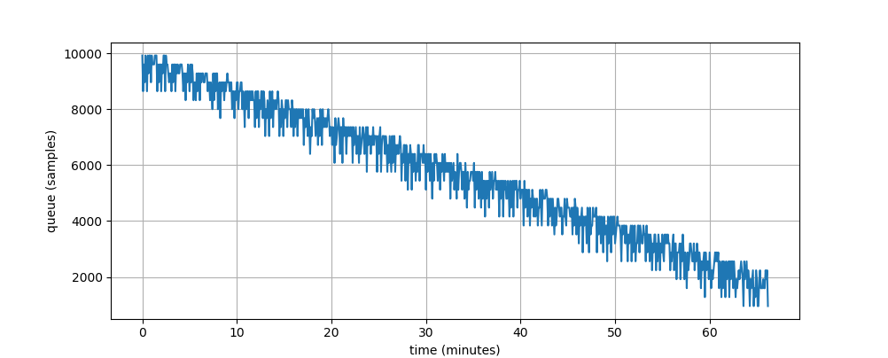

Frequency estimator and resampler
*********************************

.. contents:: Table of contents:
   :local:
   :depth: 1

Problem
=======

If you are going to roll your own media cast software you'll face few non-obvious pitfalls. This page provides a description of these obstacles and measures Roc took to avoid them.

Frequency generators are not created equal. 44100 Hz generated on different sound cards (even if the cards are similar) slightly differ in a few tens of Hertz. This gives us the difference in speed of samples transfer that leads to buffer overruns and underruns.

Let's imagine an experiment. Assume two hosts, the first one sends sound via the network to the second one. The first host generates samples with 44090 Hz (every 22.681 us) and the second one transfers received samples to sound card with 44110 Hz (22.671 us). First one is slower in 10 ns for every sample. Every second incoming queue of the receiver diminishes for 0.441 ms of sound. Sooner or later it would dry up and the user would hear scratches. Likewise, if the sender is a bit faster than the receiver, the user would feel a delay between the picture on the screen and sound if she or he is watching a video. Both situations are not acceptable and Roc is designed to avoid them.

Here is the result of a real experiment. Sender and receiver were running on two computers in one LAN. The sample rate was 44100 Hz and the initial queue size was 10000 samples. The receiver soundcard turned out to be a bit faster than the sender soundcard. After about 60 minutes playback the delay between receiver and sender reached 10000 samples and the playback had broken. This means that every hour the receiver timer outruns the sender timer by approximately 200 milliseconds and the clock difference is about 0.0055%.

We must mention that samples come in packets and incoming queue consists of the received packets. However, it doesn't change anything and we still have to care about underruns and overruns.

Solution
========

So Roc needs to adjust somehow receiver's frequency to the sender's frequency. In order to do so, Roc converts the sample rate of input samples on the receiver's side with factor equals to sender_frequency / receiver_frequency.

This task is broken into three parts:

1. measure current latency - the latency monitor;
2. acquire frequencies factor - the frequency estimator;
3. adjust the frequency - the resampler.

Frequency estimator is on duty of reporting more or less credible frequencies factor to the resampler. Resampler is continuously taking input samples and producing output samples a slightly faster or slower depending on its setting.

From the top view latency monitor talks to frequency estimator the current latency. Frequency estimator talks to resampler how this host is faster or slower than sender and resampler compensates for this bias in speeds. Resampler adjusts the playback rate to compensate for the difference.

Here is the overall picture:

.. image:: ../_images/fe_resampler.png
    :align: center
    :alt: Frequency estimator and resampler

Frequency estimator
===================

The receiver has to accumulate some amount of samples before starting playing them to eliminate scratches caused by network jitter. So the incoming packet queue consists of the preserved packets that have not been requested to be played yet. Before receiver starts playing it accumulates a few packets in that queue.

The frequency estimator is fed with the actual length of the incoming queue measured in samples. Soon the incoming queue begins to grow or diminish according to frequencies ratio. Frequency estimator detects that changes in queue length and tunes its output so the resampler begins to read samples at a higher/slower rate from the incoming queue.

This is a chain of consequences:

* the more the incoming queue length differs from its starting value;
* the more frequency estimator output differs from 1.0;
* the resampler reads faster or slower from the incoming queue;
* the length of the incoming queue decreases its grow/diminish.

Frequency estimator calculates its output using a `PI-controller <https://en.wikipedia.org/wiki/PID_controller>`_. The proportional component counteracts the deviation of the queue length observable at the moment. The integral component counteracts the steady clock difference between the sender and the receiver observable over time.

Frequency estimator directly affects sound quality. It must operate very smoothly, so it uses two `decimators <https://en.wikipedia.org/wiki/Downsampling_(signal_processing)>`_ to downsample its input value by 100 times. The internal PI-controller is also very inertial.

Resampler
=========

The main idea of current resampler's implementation was taken from `this paper <https://ccrma.stanford.edu/~jos/resample/resample.pdf>`_. It's pretty hard to compete with this paper in clarity so if you're fond of DSP and such kind of things we'll refer to this paper for the algorithm details. It'd be better to describe the rest technical stuff here.

Internally, resampler operates a moving *window*. An output sample is a function of all samples in the window. The window is implemented on top of three *frames*, stored in a circular buffer. Resampler reads samples from the pipeline frame-by-frame. When the window moves outside the middle frame boundaries, the circular buffer is rotated and the next frame is requested from the pipeline.

For the purpose of optimization, resampler performs internal computations using fixed-point numbers and uses a pre-calculated table for the `sinc <https://en.wikipedia.org/wiki/Sinc_function>`_ function.

Resampler is configured with two parameters:

* window size, determining the resampling quality and CPU consumption, which depends linearly from this parameter
* sinc table precision, determining the resampling quality and memory consumption, which also depends linearly from this parameter

In order to hide these details from the user, there are three predefined profiles ("low", "medium", "high"), offering different compromises between the quality and resource consumption.

Finally, it's worth to mention that the resampler is actually used for two purposes:

* to compensate for the frequency difference between the sender and receiver, as described above;
* to convert the network sample rate to the soundcard sample rate, e.g. 44100 to 48000.

To achieve this, the scaling factor passed to resampler is actually a product of two ratios:

* dynamic ratio computed by frequency estimator;
* static ratio computed from the network and soundcard sample rates.

The resampler can also be used on the sender, but solely for the static ratio conversion.
