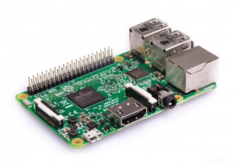
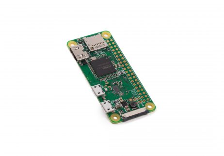
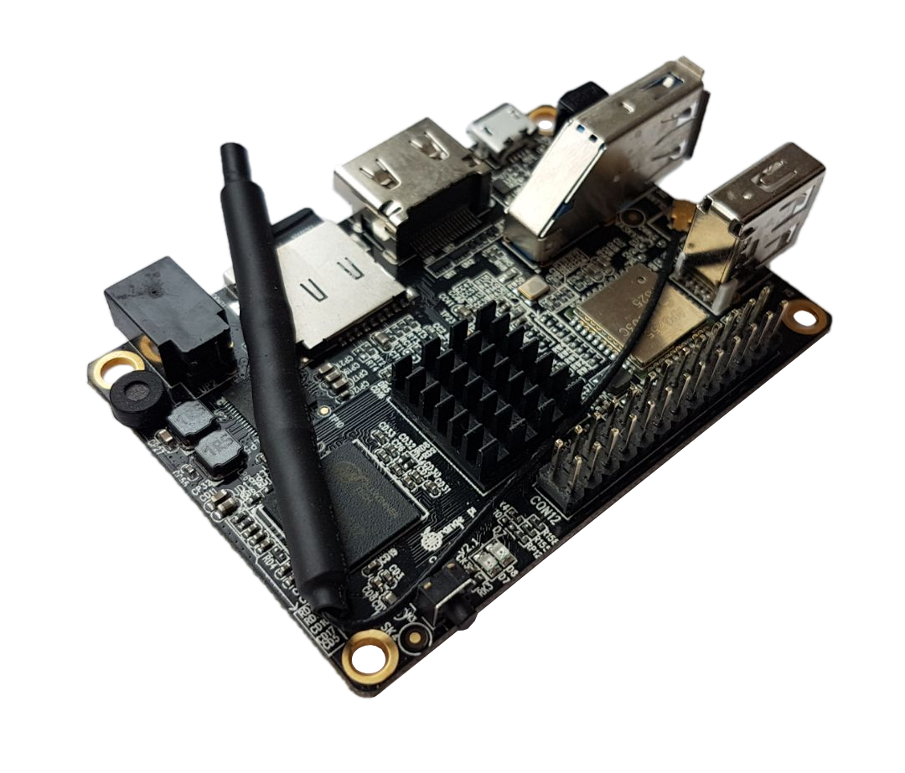

Tested boards
*************

.. contents:: Table of contents:
   :local:
   :depth: 2

ARM-based single-board computers
================================

Raspberry Pi 3 Model B
----------------------

* Website: https://www.raspberrypi.org/products/raspberry-pi-3-model-b/
* OS: Raspbian Stretch 32-bit
* Toolchain: :ref:`arm-linux-gnueabihf <arm-linux-gnueabihf>`
* CPU: 64-bit ARMv8 Cortex-A53 Quad-core 1.2GHz
* RAM: 1GB
* Wi-Fi: 802.11n

Raspberry Pi Zero W
-------------------

* Website: https://www.raspberrypi.org/products/raspberry-pi-zero-w/
* OS: Raspbian Stretch 32-bit
* Toolchain: :ref:`arm-bcm2708hardfp-linux-gnueabi <arm-bcm2708hardfp-linux-gnueabi>`
* CPU: 32-bit ARMv6 BCM2835 Single-core 1GHz
* RAM: 512MB
* Wi-Fi: 802.11 b/g/n

Orange Pi Lite 2
----------------

* Website: http://www.orangepi.org/Orange%20Pi%20Lite%202/
* OS: Ubuntu 16.04 for OrangePi Lite2 64-bit
* Toolchain: :ref:`aarch64-linux-gnu <aarch64-linux-gnu>`
* CPU: 64-bit ARMv8 Cortex-A53 Quad-core 1.8GHz
* RAM: 1GB
* Wi-Fi: 802.11 ac/b/g/n

